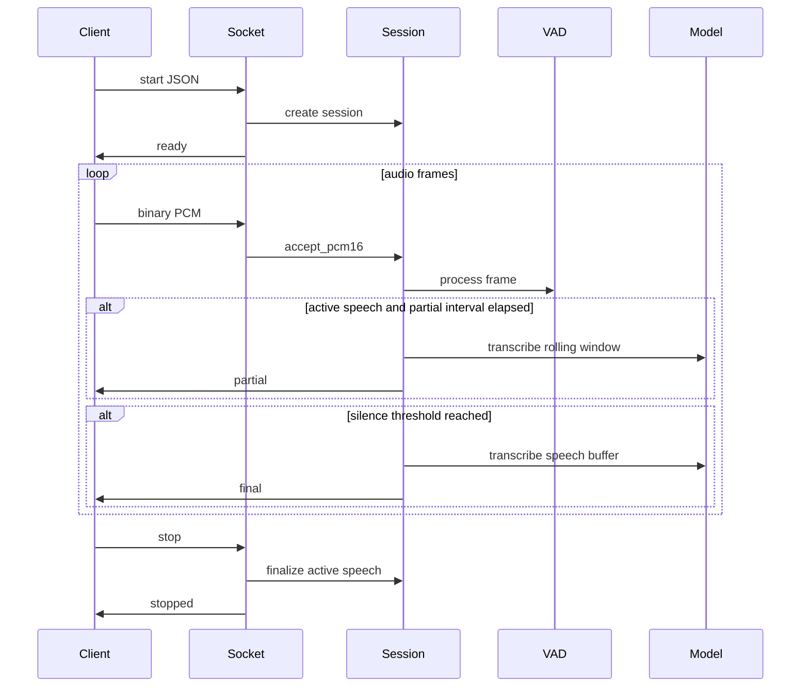
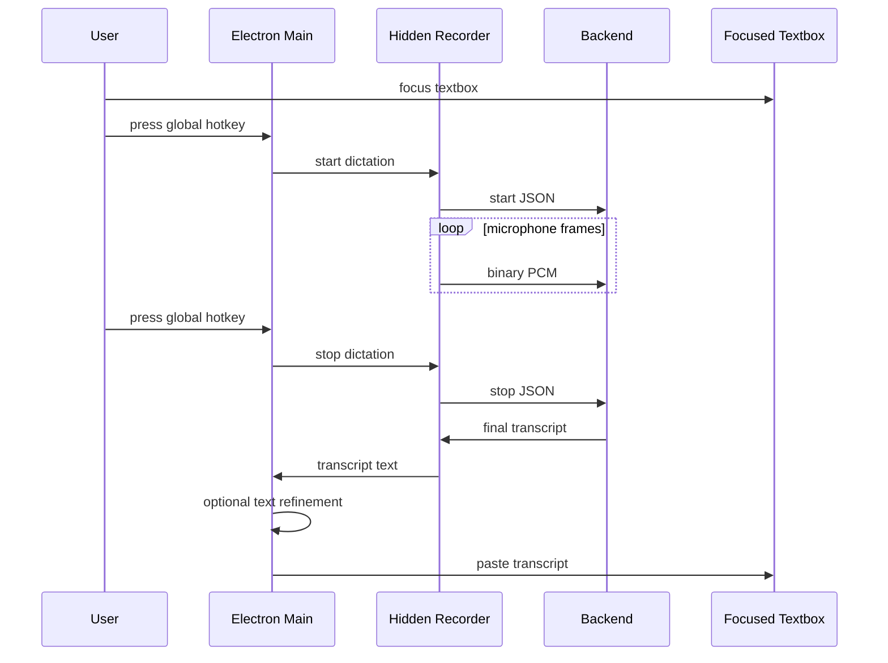

# Architecture

Openflow is a local dictation stack. The backend owns API validation, transcription sessions, VAD, faster-whisper inference, and transcript event generation. The desktop client owns the Windows hotkey, microphone capture, and text insertion.

## Components

- FastAPI app: exposes `/health`, `/v1/models`, and `/v1/transcribe`.
- WebSocket handler: validates control messages, accepts PCM audio frames, and returns JSON events.
- Session: manages rolling buffers, VAD state, partial/final triggers, and duplicate cleanup.
- Transcriber: owns faster-whisper model loading and inference.
- Scripts: provide local file transcription, WAV streaming, and model benchmarking.
- Electron main process: registers the global hotkey, starts the backend, manages the tray menu, optionally refines finalized text with llama.cpp or Ollama, and pastes text into the focused app.
- Electron recorder renderer: captures microphone audio, converts it to `pcm_s16le` mono 16 kHz, and streams it to the backend WebSocket.

## Live Transcription Flow

## Desktop Dictation Flow

