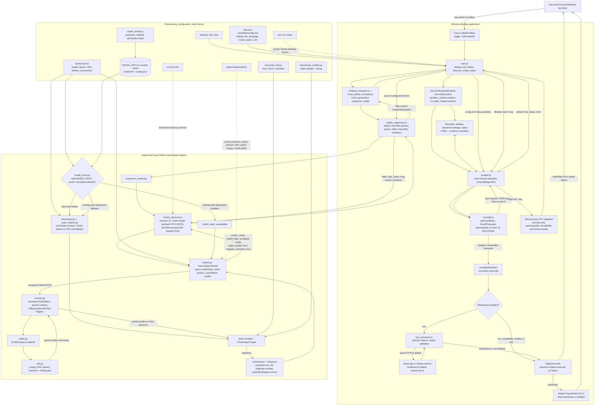

# Durianflow Project Pipeline

This is the end-to-end map of the desktop dictation path, Python sidecar, model lifecycle, optional local refinement, command-line utilities, and checks. The root documentation calls the product **Durianflow**; several desktop and backend identifiers retain the earlier **Openflow** name.

The solid arrows are runtime or utility data/control flow. Dashed arrows describe documentation and verification. The worker is local-only: it uses supervised stdio rather than an HTTP listener. Audio and transcript state are held in memory for the active session; durable state is the Electron configuration and the installed model cache.
