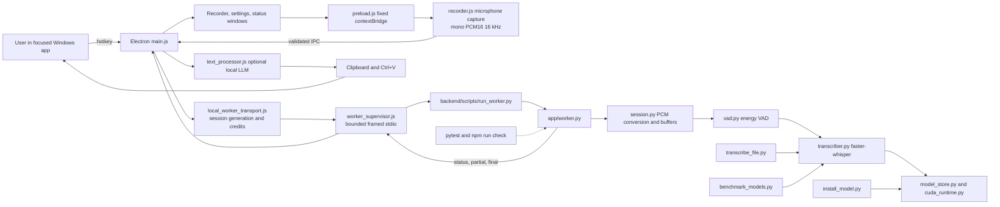

# Repository Flow

Durianflow is a local Electron dictation application. Electron owns user-facing
state and the Python worker owns transcription; the worker exposes no network
listener.

`worker_protocol.py` defines the length-prefixed JSON records, validates
commands, and bounds audio before decode. `protocol.md` documents that local
worker contract.
